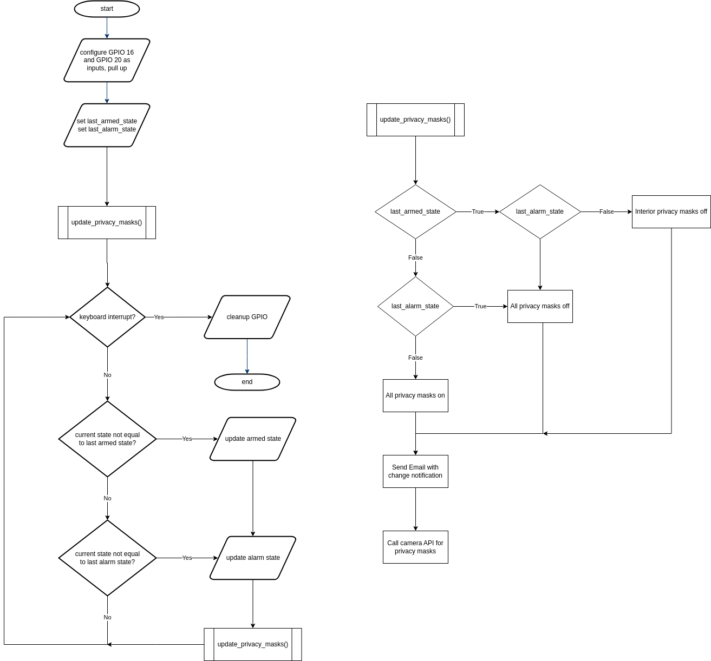

# Camera Pi

This repository allows for privacy masks to be enabled and disabled. It is intended to be connected to a security 
system or some system that can provide an "armed" state and an "alarm" state.

## security-system-check.py Flowchart

## Environment Setup and Pi Setup

With a Raspberry Pi and a base OS perform the following steps to deploy the code. You should be able to use any 
Raspberry Pi. In the next steps you will clone the git repository, setup your Python virtual environment, 
download the required packages from PyPi, and then install the service. This assumes you are currently in the 
user's home directory and with a subfolder of `security-camera-privacy-mask`

1. `git clone git@bitbucket.org:mount7freiburg/security-camera-privacy-mask.git`
2. `cd security-camera-privacy-mask`
3. `python -m venv .venv`
4. `.venv/bin/pip install -r requirements.txt`
5. `cp .env.example .env`
6. `cp cameras.json.example cameras.json`
7. Make appropriate changes to `.env` file
8. Make appropriate changes to `cameras.json` file
9. Connect wires to GPIO 16 and GPIO 20 for the Raspberry Pi
10. Configure `crontab` to run `deploy.sh` (optional)
    1. This will perform a `git pull` and restart the service

## Service Setup

1. `cp security-camera-privacy-mask.service /etc/systemd/system/camerapi.service`
2. `sudo systemctl daemon-reload`
3. `sudo systemctl enable camerapi.service`

## Understanding the env vars and cameras.json file

I am using [Postmark App](https://postmarkapp.com/) for sending emails. You can use any service you want. If you use
a different service you will need to probably configure a different client or SMTP service.

> [!IMPORTANT]  
> In Dahua cameras the password has a maximum of 32 characters even though the form lets you input more. Keep the .env
> at 32 characters if your password is longer and it should work

The `.env` file also contains `LOGFILE_PATH` should be the full path to your log file. `LOG_DEBUG` can be any integer
that is typically used for Python logging levels (0, 10, 20, 30... etc). `CAMERA_USERNAME` and `CAMERA_PASSWORD` needs
to be a user that is allowed to make configuration changes. The camera API calls are programmed to call Dahua cameras.
This should also work with Dahua whitelabeled cameras.

The `cameras.json` file contains **channel**, **type**, and **ip**. Only **ip** and **type** are required. The **type**
field can either be `exterior` or `interior`. Channel doesn't do anything but can be used as a reference for you.

## Testing

For testing, at the moment, I just comment out the GPIO lines and run my tests by changing the booleans to test the 
cameras. The most common problem I encountered when testing was if the cameras are on a different subnet and the
lengthy password preventing the API call to fire.